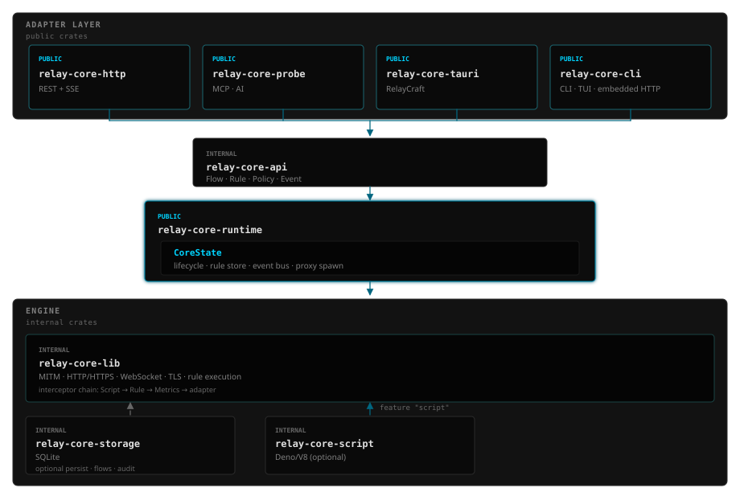

# RelayCore

**可嵌入的 Rust 流量拦截引擎 — 一套 runtime，CLI / REST / MCP / Tauri 多种接入。**

在本地捕获、检查、修改 HTTP/HTTPS/WebSocket 流量。面向需要程序化控制（规则、脚本、断点）的开发者，以及通过原生 MCP 观察实时流量的 AI Agent — 而不只是 GUI 抓包工具。

[](https://relaycore.dev) [](https://crates.io/crates/relay-core-runtime) [](https://docs.rs/relay-core-runtime) [](LICENSE)

[English](README.md) · [文档](https://relaycore.dev/docs/getting-started) · [Releases](https://github.com/relaycraft/relay-core/releases)

> crates.io 上 `relay-core` 名称已被占用，**`relay-core-runtime`** 是官方主库 crate。

---

## 快速开始（CLI）

```bash
# 安装（任选其一）
cargo install relay-core-cli
npm install -g @relay-core/cli

# HTTPS 拦截：生成并信任本地 CA（只需一次）
relay-core-cli ca generate && relay-core-cli ca install
# npm：relay-core ca generate && relay-core ca install

# 启动代理（默认 127.0.0.1:8080），可选 REST/SSE API 端口 8082
relay-core-cli run --listen 127.0.0.1:8080 --api-port 8082

# 或使用终端 UI
relay-core-cli run --ui
```

将浏览器或应用的代理指向 `127.0.0.1:8080`。完整指南：[快速开始](https://relaycore.dev/docs/getting-started) · [安装说明](https://relaycore.dev/docs/installation)

---

## 为什么选择 RelayCore

| | RelayCore | GUI 抓包工具 | 脚本型工具 |
|---|-----------|--------------|------------|
| **形态** | 可嵌入引擎 + 多适配器 | 人工查看 | 自动化脚本 |
| **运行时** | Rust 异步引擎 | JVM / 桌面应用 | Python 等 |
| **集成** | CLI · REST · SSE · MCP · Tauri | API 有限 | 脚本能力强 |
| **AI** | 原生 MCP（`relay-core-probe`） | 需自建 | 需自建 |

**适合：** 本地 API 调试 · 开发环境 HTTPS MITM · WebSocket 检查 · CI 流量录制 · 桌面应用内嵌代理 · **AI Agent 观察实时流量**

**不适合：** 生产反向代理、CDN 边缘、面向不可信用户的多租户公网 MITM。

---

## 架构

分层 crate 设计：**Adapter → API → Runtime → Engine**。公开适配器共享 `CoreState`；引擎负责 MITM、规则执行及可选脚本/持久化。

<p align="center">
  <a href="https://relaycore.dev/#architecture">
    
  </a>
</p>

<p align="center"><sub>实线 = 主依赖 · 虚线 = 可选（持久化 / <code>feature "script"</code>）· <a href="https://relaycore.dev/docs/architecture">详细说明</a></sub></p>

---

## Crates

| Crate | 角色 | 状态 |
|-------|------|------|
| [`relay-core-runtime`](https://crates.io/crates/relay-core-runtime) | 主 API — 状态、生命周期、规则、事件 | Public |
| [`relay-core-http`](https://crates.io/crates/relay-core-http) | REST + SSE 适配器 | Public |
| [`relay-core-probe`](https://crates.io/crates/relay-core-probe) | AI Agent MCP 适配器 | GA |
| [`relay-core-cli`](https://crates.io/crates/relay-core-cli) | CLI · TUI · 内嵌 HTTP API | GA |
| `relay-core-tauri` | Tauri 插件（RelayCraft 桌面端） | Internal |

内部 crate：`relay-core-api`、`relay-core-lib`、`relay-core-storage`、`relay-core-script` — 不建议下游直接依赖。

---

## AI Agent（MCP）

在 Cursor、Claude Desktop 等 MCP 宿主中连接实时流量：

```json
{
  "mcpServers": {
    "relay-core": {
      "command": "npx",
      "args": ["-y", "@relay-core/mcp"]
    }
  }
}
```

常用工具：`search_flows`、`get_flow`、`set_rule`、`export_har`、`replay_flow`。  
文档：[MCP 指南](https://relaycore.dev/docs/mcp) · npm：[`@relay-core/mcp`](https://www.npmjs.com/package/@relay-core/mcp)

---

## Rust 嵌入

```rust
use relay_core_runtime::{CoreState, ProxyConfig};
use std::sync::Arc;

#[tokio::main]
async fn main() -> Result<(), Box<dyn std::error::Error>> {
    let state = Arc::new(CoreState::new(None).await);
    let config = ProxyConfig::from_app_data_dir("./proxy-data", 8080)?;
    let (tx, mut rx) = tokio::sync::mpsc::channel(1000);

    state.spawn_proxy(config, tx, None)?;

    while let Some(update) = rx.recv().await {
        println!("flow update: {:?}", update);
    }
    Ok(())
}
```

HTTP 适配器：[`relay-core-http`](https://docs.rs/relay-core-http) · API 参考：[relaycore.dev/docs/api](https://relaycore.dev/docs/api)

---

## 能力概览

- **MITM / TLS** — 动态证书、CA 管理
- **WebSocket** — 消息级检查、修改、重放
- **规则引擎** — 匹配 + 动作（Mock、重定向、延迟、限速等）
- **脚本** — 可选 Deno/V8（`relay-core-script`）
- **拦截断点** — 暂停、修改、继续或丢弃
- **可观测性** — Prometheus 指标、审计、可选 SQLite 持久化
- **进阶** — 透明代理（Linux/macOS/Windows）、QUIC/HTTP3 Tier-1 降级 — 见[配置文档](https://relaycore.dev/docs/configuration)

---

## 常见问题

**为什么要信任自签 CA？**  
HTTPS MITM 需要本地 CA。使用 `relay-core-cli ca generate` 生成并按[安装文档](https://relaycore.dev/docs/installation)信任。

**和 mitmproxy 有什么区别？**  
RelayCore 是可嵌入的 Rust 引擎，提供 MCP 等多种适配器，适合应用集成与自动化。参见[脚本对比](https://relaycore.dev/docs/scripting-vs-mitmproxy)。

**能当生产环境公网 MITM 吗？**  
定位是**本地开发、调试、测试与 Agent 工具**，不是面向公网的拦截基础设施。

---

## 开发

```bash
cargo test --workspace
cargo clippy --workspace
cargo test --package relay-core-tauri --test offline_dev_tests
```

透明代理平台矩阵与集成测试：`relay-core-lib/tests/transparent_proxy_test.rs`

---

## 许可证

MIT — 见 [LICENSE](LICENSE)。
